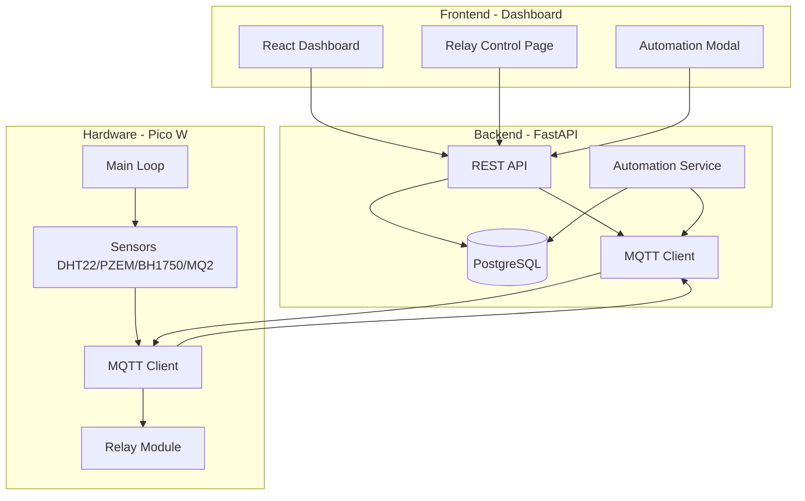

# Nusa Home System Integration - Technical Documentation

## 📋 Overview

Dokumentasi ini menjelaskan bagaimana sistem Nusa Home terintegrasi antara:
- **Pico W** (Hardware/Device Layer)
- **Backend API** (FastAPI Server)
- **Dashboard UI** (React Frontend)

Semua perubahan sistem terbaru telah menyertakan **Offline Protection Logic** untuk memastikan kendali relay aman dan akurat bahkan saat koneksi terputus.

---

## 🛡️ Offline Protection Logic

Untuk menjamin keamanan dan sinkronisasi data, sistem menerapkan logika perlindungan berikut:

### 1. Sisi Firmware (Pico W)
- **Safe Boot:** Relay diinisialisasi ke status `OFF` segera setelah daya menyala.
- **Delayed Sync:** Sinkronisasi status awal dari API baru dilakukan *setelah* koneksi MQTT terjalin. Ini memastikan alat tidak berubah status sebelum jalur kontrol siap.

### 2. Sisi Dashboard (React)
- **Control Lockdown:** Semua tombol kontrol (ON/OFF, Mode, Automation, Edit) dinonaktifkan (`disabled`) secara otomatis jika status perangkat terdeteksi `OFFLINE`.
- **Force Visual OFF:** Saat offline, status relay di UI akan dipaksa menampilkan `OFF` secara visual untuk menghindari kebingungan pengguna, meskipun database masih menyimpan status terakhir.
- **Auto-Unlock:** UI akan kembali aktif secara instan begitu perangkat mengirimkan status `READY` atau `ALIVE` via MQTT.

---

## 🏗️ Architecture Overview



---

## 🔌 Component Details

### 1. Pico W (Hardware Layer)

#### File Structure
```
pico/
├── main.py              # Entry point, main loop
├── relay.py             # Relay control logic
├── sensor_*.py          # Sensor modules
├── wifi.py              # WiFi management
├── status_manager.py    # Status reporting
└── config.py            # Configuration
```

#### Main Responsibilities

**[main.py](file:///home/hanifp/Documents/ProjectSmartHome/pico/main.py)**
- Connects to WiFi
- Initializes MQTT connection to broker
- Publishes sensor data every X seconds (configurable)
- Syncs relay states from API every 5 minutes
- Listens for MQTT commands

**[relay.py](file:///home/hanifp/Documents/ProjectSmartHome/pico/relay.py)**
- Controls 4 relay GPIO pins (10, 11, 12, 13)
- Subscribes to MQTT topic: `home/relay/{gpio}/set`
- Receives commands: `ON` or `OFF`
- Syncs initial state from API: `GET /relays`

#### MQTT Topics (Pico W)

**Subscribed Topics:**
- `nusahome/home/relay/{gpio}/set` - Relay control commands
- `nusahome/setting/interval` - Sensor interval updates

**Published Topics:**
- `nusahome/sensor/dht22` - Temperature & humidity
- `nusahome/sensor/pzem004t` - Power monitoring
- `nusahome/sensor/bh1750` - Light sensor
- `nusahome/sensor/mq2` - Gas sensor
- `nusahome/home/relay/{gpio}/state` - Relay state confirmation
- `nusahome/system/+/status` - Pico status (READY, ALIVE, etc.)

---

### 2. Backend API (Application Layer)

#### File Structure
```
app/
├── main.py                          # FastAPI app
├── api/routes/
│   ├── relay.py                     # Relay endpoints
│   └── settings.py                  # Settings endpoints
├── models/
│   └── relay.py                     # Pydantic models
├── services/
│   ├── relay_automation.py          # Automation engine
│   └── mqtt_service.py              # MQTT handler
└── db/
    └── session.py                   # Database connection
```

#### Key Endpoints

**Relay Management**
```
GET    /relays                       # List all relays
PUT    /relays/{id}                  # Update relay state
PATCH  /relays/{id}/name             # Update relay name
POST   /relays/{id}/mode             # Change mode (manual/auto)
GET    /relays/{id}/automation       # Get automation config
PUT    /relays/{id}/automation       # Update automation config
```

#### Database Schema

**Table: `status_relay`**
```sql
id          INT PRIMARY KEY
gpio        INT
name        VARCHAR
description TEXT
is_active   BOOLEAN
mode        VARCHAR('manual' or 'auto')
auto_config JSONB  -- Automation rules
```

**auto_config Structure:**
```json
{
  "type": "time" | "sensor" | "combined",
  "time_rules": [
    {
      "id": "time_1234567890",
      "days": ["mon", "tue", "wed", "thu", "fri"],
      "start_time": "18:00",
      "end_time": "06:00",
      "action": "on"
    }
  ],
  "sensor_rules": [
    {
      "id": "sensor_1234567890",
      "sensor": "dht22",
      "metric": "temperature",
      "operator": ">",
      "value": 30,
      "action": "on"
    }
  ]
}
```

#### Automation Service

**[relay_automation.py](file:///home/hanifp/Documents/ProjectSmartHome/app/services/relay_automation.py)**

Background service yang berjalan setiap 30 detik untuk:

1. **Fetch relays** dengan `mode = 'auto'`
2. **Evaluate rules** berdasarkan tipe:
   - `time`: Cek hari dan waktu
   - `sensor`: Cek nilai sensor vs threshold
   - `combined`: Kedua kondisi harus terpenuhi (AND logic)
3. **Execute action** jika rules match:
   - Update database
   - Publish MQTT command ke Pico
   - Log ke history

**Workflow Example:**
```python
# Time Rule Evaluation
if current_day in rule.days:
    if is_time_in_range(current_time, start_time, end_time):
        execute_relay_action(relay_id, action)

# Sensor Rule Evaluation
if sensor_value > threshold:
    execute_relay_action(relay_id, action)
```

---

### 3. Dashboard UI (Presentation Layer)

#### File Structure
```
dashboard/src/
├── pages/
│   └── Relay.jsx                    # Main relay control page
├── components/
│   └── AutomationModal.jsx          # Automation configuration
└── context/
    ├── MqttContext.jsx              # MQTT WebSocket
    └── AuthContext.jsx              # Authentication
```

#### UI Components

**[Relay.jsx](file:///home/hanifp/Documents/ProjectSmartHome/dashboard/src/pages/Relay.jsx)**

Main features:
- Display 4 relay cards with real-time status
- Toggle Manual/Auto mode
- ON/OFF control (manual mode only)
- Open automation configuration modal

**State Management:**
```javascript
const { relayStates, toggleRelay } = useMqtt();  // Real-time MQTT
const [apiRelays, setApiRelays] = useState([]);  // API data
```

**Key Functions:**
```javascript
handleToggle(relayId)        // Toggle relay ON/OFF
handleModeToggle(relayId)    // Switch manual ↔ auto
openAutomationModal()        // Configure auto rules
```

**[AutomationModal.jsx](file:///home/hanifp/Documents/ProjectSmartHome/dashboard/src/components/AutomationModal.jsx)**

Configuration interface:
- **Time Tab**: Schedule by day & time
- **Sensor Tab**: Trigger by sensor values
- **Combined Tab**: Both conditions required

**API Integration:**
```javascript
// Fetch current config
GET /relays/{id}/automation

// Save new config
PUT /relays/{id}/automation
{
  mode: "auto",
  auto_config: {
    type: "time",
    time_rules: [...],
    sensor_rules: [...]
  }
}
```

---

## 🔄 Data Flow Examples

### Example 1: Manual Relay Toggle

```
1. User clicks "ON" button in Dashboard
   ↓
2. UI calls: PUT /relays/1 { is_active: true }
   ↓
3. Backend updates: status_relay SET is_active = true
   ↓
4. Backend publishes: nusahome/home/relay/10/set → "ON"
   ↓
5. Pico W receives MQTT message
   ↓
6. Pico W sets GPIO 10 HIGH
   ↓
7. Pico W confirms: nusahome/home/relay/10/state → "ON"
   ↓
8. Dashboard updates via MQTT WebSocket
```

### Example 2: Automation Trigger (Time-based)

```
1. Automation service runs every 30s
   ↓
2. Fetches relays WHERE mode = 'auto'
   ↓
3. Evaluates time rules:
   - Current day: "mon"
   - Current time: "18:30"
   - Rule: days=["mon","tue"], start="18:00", end="22:00", action="on"
   ↓
4. Rule matches! Execute action:
   - UPDATE status_relay SET is_active = true
   - PUBLISH nusahome/home/relay/10/set → "ON"
   - INSERT history log
   ↓
5. Pico W receives and executes
   ↓
6. Dashboard shows updated state
```

### Example 3: Sensor-based Automation

```
1. Pico W reads DHT22: temperature = 32°C
   ↓
2. Publishes: nusahome/sensor/dht22 → {"temperature": 32, ...}
   ↓
3. Backend stores in data_dht22 table
   ↓
4. Automation service evaluates sensor rules:
   - Rule: sensor="dht22", metric="temperature", operator=">", value=30, action="on"
   ↓
5. Condition met (32 > 30) → Turn relay ON
   ↓
6. MQTT command sent to Pico W
   ↓
7. Relay activated automatically
```

---

## ✅ Compatibility Verification

### UI Changes Made

1. ✅ **Color scheme** (purple → teal) - **UI only**, tidak mempengaruhi data
2. ✅ **Button text** ("TURN ON" → "ON") - **UI only**
3. ✅ **Icon sizes & spacing** - **UI only**
4. ✅ **Compact layout** - **UI only**

### Backend Integration Points

| UI Action | API Endpoint | Data Format | Pico Compatible |
|-----------|--------------|-------------|-----------------|
| Toggle relay | `PUT /relays/{id}` | `{is_active: bool}` | ✅ Yes |
| Change mode | `POST /relays/{id}/mode` | `{mode: "manual"\|"auto"}` | ✅ Yes |
| Save automation | `PUT /relays/{id}/automation` | `{mode, auto_config}` | ✅ Yes |

### Data Structure Compatibility

**Pico W expects:**
- MQTT topic: `nusahome/home/relay/{gpio}/set`
- Payload: `"ON"` or `"OFF"` (string)

**Backend sends:**
```python
mqtt_client.publish(
    f"nusahome/home/relay/{gpio}/set",
    "ON" if is_active else "OFF"
)
```

✅ **100% Compatible** - Semua perubahan UI tidak mengubah struktur data atau protokol komunikasi.

---

## 🚀 Deployment & Testing

### Starting the System

**1. Start Backend**
```bash
cd /home/hanifp/Documents/ProjectSmartHome
python -m app.main
```

**2. Start Dashboard**
```bash
cd dashboard
npm run dev
```

**3. Flash Pico W**
```bash
# Upload semua file di folder pico/ ke Pico W
# Restart Pico W
```

### Verification Steps

**Check Pico W:**
```
- WiFi connected
- MQTT connected
- Sensors publishing
- Relays synced from API
```

**Check Backend:**
```
- API running on port 8000
- MQTT broker connected
- Automation service active
- Database accessible
```

**Check Dashboard:**
```
- Open http://localhost:5000/relay
- See 4 relay cards
- Toggle manual/auto
- Configure automation
```

---

## 🔧 Troubleshooting

### Issue: Relay tidak merespon dari UI

**Diagnosis:**
1. Cek Backend logs: apakah MQTT publish berhasil?
2. Cek Pico W logs: apakah menerima MQTT message?
3. Cek database: apakah `is_active` terupdate?

**Solution:**
- Pastikan MQTT broker running
- Pastikan Pico W connected ke MQTT
- Restart Pico W untuk re-sync

### Issue: Automation tidak jalan

**Diagnosis:**
1. Cek mode relay: harus `'auto'`
2. Cek automation service running
3. Cek auto_config: apakah rules valid?

**Solution:**
- Pastikan automation service started di backend
- Cek logs automation service untuk error
- Validasi time/sensor rules

### Issue: UI tidak update real-time

**Diagnosis:**
- MQTT WebSocket connection di dashboard
- Cek browser console untuk errors

**Solution:**
- Refresh dashboard
- Cek MQTT broker accessible dari browser

---

## 📝 Summary

### Keseluruhan Sistem Bekerja Dengan:

1. **Pico W** → Eksekusi fisik relay berdasarkan MQTT commands
2. **Backend** → Koordinasi antara UI, database, dan automation
3. **Dashboard** → Interface untuk kontrol manual dan konfigurasi automation

### Perubahan UI yang Dilakukan:

- ✅ Warna harmonis (teal theme)
- ✅ Ukuran compact
- ✅ Font konsisten
- ✅ Layout rapi
- ✅ **Offline Protection Added** (Backend, Firmware, & UI)

### Tidak Ada Perubahan Pada:

- ❌ Struktur data API (Hanya penambahan field/logic internal)
- ❌ Format MQTT messages
- ❌ Database schema utama

**Kesimpulan: Semua perubahan bersifat visual/UI saja dan 100% backward compatible dengan sistem yang ada!** ✅
